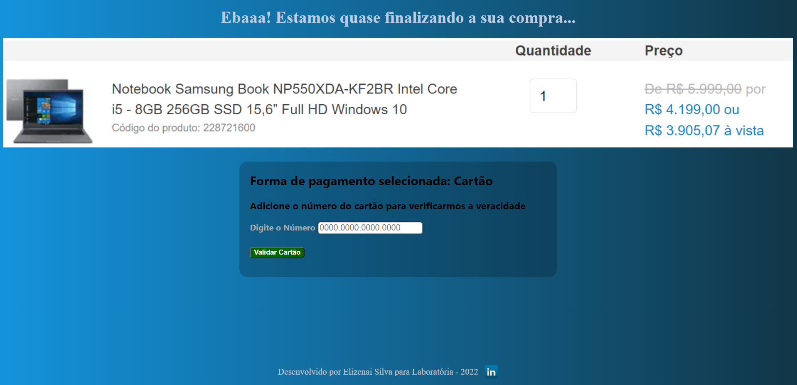

# Projeto: Validador de Cartão - Algorítmo de Luhn

## Índice

- [1. Usuário](#1-Usuário)
- [2. Resumo do projeto](#2-Resumo-do-projeto)
- [3. Design](#3-Design)
- [4. Tecnologias](#4-Tecnologias)

---

## 1. Usuário

 O público são consumidores que preferem fazer suas compras de forma online e optam pelo pagamento via cartão, antes do cliente cadastrar todos os seus dados, primeiro é feito a conferência se o cartão a ser utilizado é válido ou não, e o prejeto trata-se justamente desta etapa da validação.

## 2. Resumo do projeto

Criei um ambiente de e-commerce mais precisamente ja na etapa de pagamento via cartão, a proposta foi fazer validar os dados do cartão inserido pelo usuário através do [Algorítimo de Luhn](https://en.wikipedia.org/wiki/Luhn_algorithm), posteriormente seguir com a finalização do pagamento caso seu cartão seja válido, e assim poder realizar a compra.

Após inserir os números do cartão que são limitados até 16 caracteres, clicando no botao "Verificar Cartão", abaixo aparece o resultado se o mesmo é valido ou não com os dígitos ocultos com ###, restando apenas 4 dígitos expostos, se for válido, a informação aparece na cor verde, se não, a resposta da negativa é apresentada na cor é vermelha, caso não seja digitado nenhuma informação no campo, e ainda assim o botão "Verificar Cartão" seja clicado, o retorno é de um pop-up com a mensagem:"Preencha o campo abaixo".
No rodapé há uma paquena imagem do logo do linkedin, que ao clicar direciona ao meu perfil.

## 3. Design

[Projeto](https://elizenai.github.io/SAP007-card-validation/).

## 4 . Tecnologias
- HTML5
- CSS3
- JavaScript
- Git e GitHub
- Node.js
- Trello

---
Criado por [Elizenai Silva](https://github.com/elizenai), primeiro projeto da Laboratória - [Linkedin](https://www.linkedin.com/in/elizenai/).
